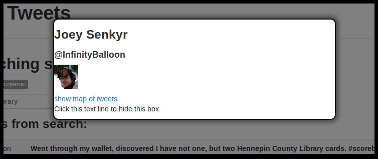
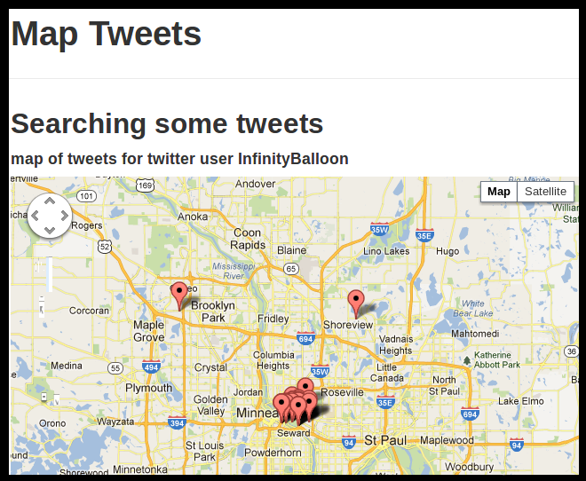

Tweet Mapper
============

playing around with a tweet to google api example

Tweets as Search Results
------------------------
When search results are returned you can click on either the twitter user name or the text of the tweet itself to bring up details about the twitter user.

Tweet User Details
------------------
The details for a twitter user will show their real name, their twitter handle, and their photo if one is available. You can also access a map of their tweets from this display.

Access To Map Of Tweets
-----------------------
The details about the user display also gives you access to map all of the recent tweets for that user on a map. Neat, huh?

Close the Modal
---------------
Close the modal to be able to interact with the generated map.

Format
------
the map of tweets (which have geo data) can be called directly with this url:
> http://localhost/tweetmapper/#/map/<twitter_user_name>

A good one to try that I was testing with is InfinityBalloon
> http://localhost/tweetmapper/#/map/InfinityBalloon

Important Notes
---------------
instead of using GET search/tweets (which returns an error) use the following format:

> http://search.twitter.com/search.json?q=search%20criteria&rpp=100&include_entities=true&result_type=mixed

the error given by the GET search/tweets API is:
> {"errors":[{"message":"Bad Authentication data","code":215}]}

twitter documentation indicates the necessity of using OAUTH to use this API
> https://dev.twitter.com/docs/api/1.1/get/search/tweets